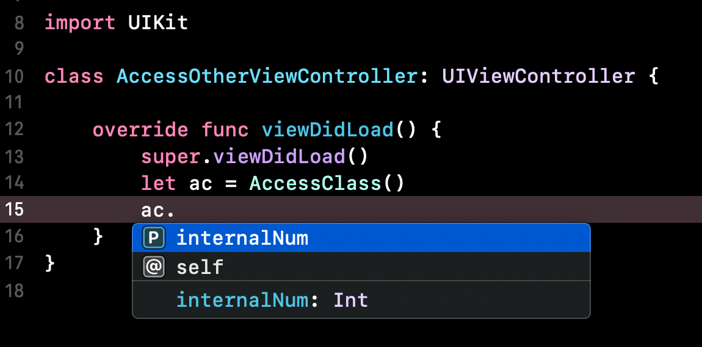
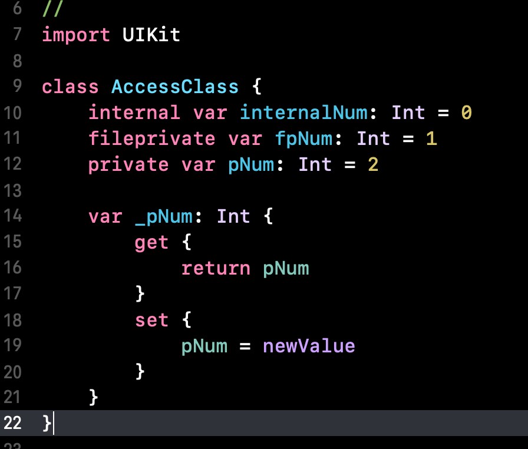

# Access Control - 접근제어

## 목차
1. 의의
2. 모듈 / 소스파일
3. 접근레벨

## 1. 의의
- 코드의 일부에 대한 접근을 제한하고자 할 때 사용
- 코드의 불필요한 외부 노출을 제한해 은닉화

---

## 2. 모듈 / 소스파일
### 1) 모듈
- import해서 프로젝트에 사용하는 프레임워크 같은것
- 모듈은 주로 open, public을 통해 접근제어

### 2) 소스 파일
- 하나의 프로젝트 내의 파일
- 주로 internal, fileprivate, private을 사용해 접근제어

---

## 3. 접근레벨
- open > public > internal > fileprivate > private 순으로 개방도를 가진다.

### 1) 모듈 - open, public
- **open**  
  외부 모듈을 자신의 프로젝트에 사용 가능.  
  클래스에서만 사용 가능. 오버라이딩 가능.
- **public**  
  struct, enum에서도 사용가능.  
  클래스에서 사용하는 경우 상속, 오버라이딩 불가.

### 2) 소스파일 - internal, fileprivate, private
- **internal**  
  아무 접근제어자를 사용안하면 internal.  
  그냥 쓰던대로 쓰는거임.
- **fileprivate**    

        
  

p는 대문자가 아니다.  

위 스크린샷 처럼 같은 스위프트 파일 내에서는 접근이 가능하다. 값을 수정하는거도 가능.  

        
  

다른 스위프트 파일에서는 접근이 안된다.  

- **private**  
한 블록( { } 내부 )에서만 접근이 가능하다.

        
  

위에 위에 있는 스샷인데 같은파일이라 fileprivate는 접근이 되지만 private는 {} 외부라서 안됨.  

그럼 언제씀?  

        
  

이럴때 주로 사용함. 하다보니 _를 반대로 사용함ㅋㅋ

   

