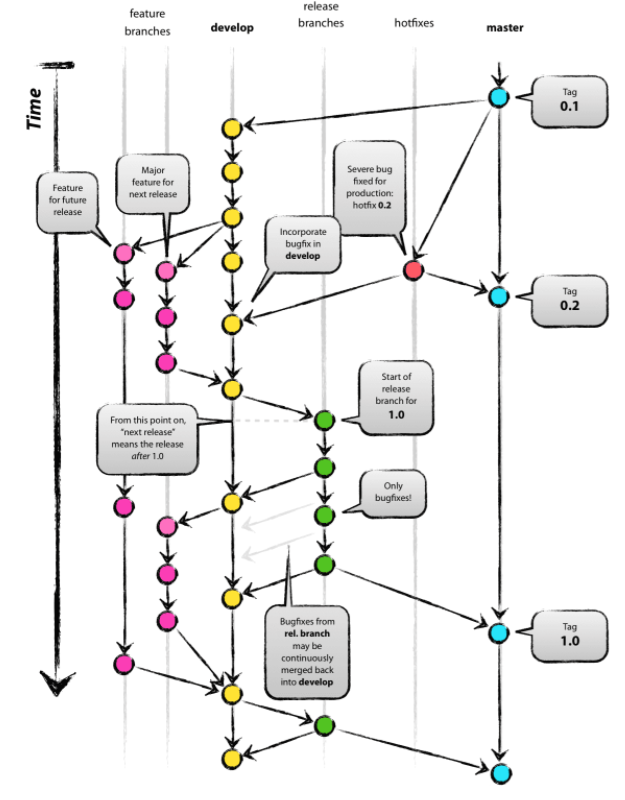

# Git Flow - 개념

## 목차
1. 개념
2. 모델
3. 개발 프로세스

---

## 1. 개념
- 5가지의 브랜치를 이용해 개발하는 브랜치 전략
- main, develop, feature, release, hotfix 5개의 브랜치를 사용

### 브랜치 종류
- main: 앱을 배포하는 브랜치
- develop: 개발 브랜치. feature 브랜치에서 개발된 기능들이 여기에 merge 된다.
- feature: 단위 기능들을 개발하는 브랜치. 개발완료시 develop 브랜치에 merge 한다.
- release: develop 브랜치에서 기능들이 합쳐진 후 테스트 또는 QA를 위해 사용되는 브랜치.
- hotfix: 앱 배포후 빠르게 고쳐야하는 버그가 있을때 main에서 분리하는 브랜치.

---

## 2. 모델

        
    

---

## 3. 프로세스

1. main 브랜치에서 시작한다.
2. develop 브랜치를 생성하고 개발이 진행된다.
3. 로그인이나 회원가입 등의 단위 기능들은 feature 브랜치에서 개발한다.
4. feature 브랜치에서 단위 기능들이 개발 완료가 되면 develop 브랜치에 merge한다.
5. 이후 develop 브랜치에서 배포 전에 QA가 진행되기 위해서 release 브랜치를 만든다.
6. release 브랜치에서 발견된 버그나 수정사항 등을 변경한 후에 main, develop 브랜치에 반영한다.
7. release 브랜치에서 테스트 또는 QA가 완료된다면 main 브랜치에 반영 후 배포한다.

 

