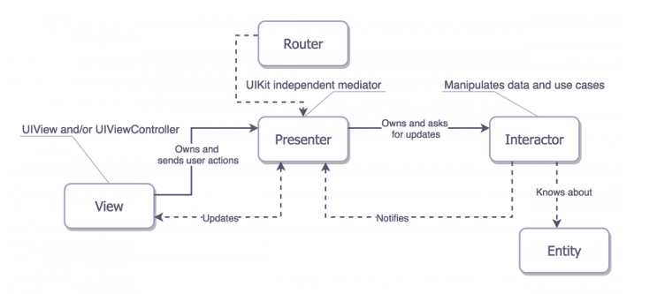

# VIPER

## 목차
1. 의의
2. 구성
3. 예시분석

---

## 1. 의의
- 책임 분배를 더 고려해서 만들어진 패턴이다.
- 기존 MVC 등 기존의 MVX 패턴과 다르게 5개의 구성요소를 가지고 있다.
- View, Interactor, Presenter, Entity, Router 들을 구성요소로 가지고 있다.

## 2. 구성
### View
- UI를 담당한다.
- UIViewController에 해당된다.
- Presenter에 의존성을 가지고 있다.
- 터치 등의 이벤트를 Presenter에 전달하고 받은 데이터를 이용해 UI를 업데이트.

### Presenter
- Router, Interactor에 의존성이 있다.
- View에서 받은 이벤트를 Router 또는 Interactor를 통해 처리한다.

### Interactor
- 비지니스 로직을 담당.
- 네트워크 또는 DB를 통해 Entity를 처리하고 Presenter로 보낸다.

### Router
- 화면전환과 의존성 주입을 담당한다.
- 사용하기 위해 앱 전체를 담당하는 AppRouter가 필요하다.

### Entity
- 프로젝트에서 사용하는 데이터 모델들이다.
- Interactor를 통해서 다루게 된다.

---

## 3. 예시분석
### Router
```swift
protocol Router {
    var navigationController: UINavigationController { get }
    
    func start()
}
```

- Router는 기존에 알고있던 Coordinator와 비슷하게 사용된다.
- AppRouter를 AppDelegate에 만들어 놓고 화면시작과 의존성 주입을 수행한다.
- start 메서드는 의존성 주입을 수행한다.

### View
```swift
protocol ViewProtocol {
    var presenter: Presenter { get }
}
```

- View는 Presenter에 의존성을 가지고 있으므로 위와 같은 형태가 된다.

### Presentor
```swift
protocol Presenter {
    var interactor: Interactor { get }
    var router: Router { get }
}
```

- Presenter는 Interactor와 Router에 의존성을 가지고 잇으므로 위와 같은 형태가 된다.

### Interactor
```swift
protocol Interactor {
    var service: APIService { get }

    func fetchData() 
}
```

- Interactor는 네트워크 또는 DB를 통해 Entity를 다룬다.
- 따라서 APIService 같은 프로퍼티나 데이터를 다루는 메서드를 가지고 있다.

---

<div align = "center">        
  
</div>

- 위의 그림처럼 VIPER 구조가 구성되어있다.
- UI, 이벤트 수행, 화면전환 및 의존성주입, 비즈니스 로직, 모델의 5가지 역할을 나누었다.
- 기존 MVC 등 MVX 패턴보다 더 역할을 분배해 프로젝트를 관리한다.
- 보통은 뷰 하나당 이런 구조를 가지게 되는데 이런식의 거대한 구조를 가져야 하는지 프로젝트에 대한 고려가 필요해야할거 같다.