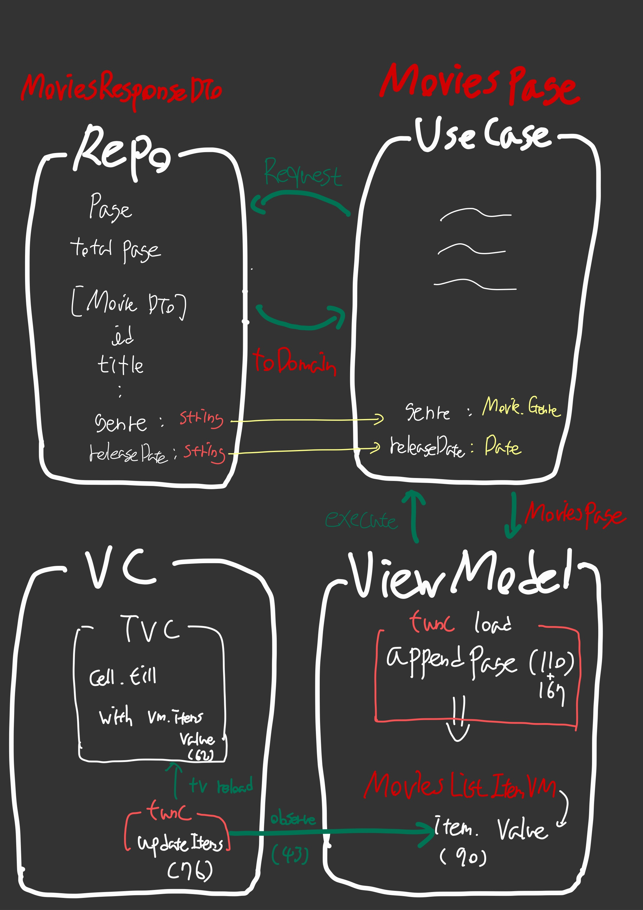

# iOS-Clean-Architecture 예제 분석

1. Repository - DTO + Mapping
2. UseCase - Entity
3. ViewModel - Entity to ItemViewModel
4. View
5. 결론

- 서버에서 받아오는 데이터의 가공 위주로 **간략하게** 분석 [참고자료](https://github.com/kudoleh/iOS-Clean-Architecture-MVVM)

---

## 1. Repository - DTO + Mapping

```swift
//...

public func fetchMoviesList(
    query: MovieQuery,
    page: Int,
    completion: @escaping (Result<MoviesPage, Error>) -> Void
    ) {        
        task.networkTask = self.dataTransferService.request(with: endpoint) { result in
            switch result {
            case .success(let responseDTO):
                self.cache.save(response: responseDTO, for: requestDTO)
                completion(.success(responseDTO.toDomain()))
            case .failure(let error):
                completion(.failure(error))
            }
        }    
    }

```

- Repository에서는 요청정보를 받아 통신을하고 responseDTO 형태로 response를 받는다
- 그리고 toDomain()을 이용해 Mapping 후 UseCase로 보낸다.
- DTO와 Mapping 된 데이터의 차이  
  genre의 경우 String에서 Movie.genre라는 자료형으로  
  releaseDate의 경우 String에서 Date라는 자료형으로 변경

## 2. UseCase - Entity
```swift
func execute(requestValue: SearchMoviesUseCaseRequestValue,                 
             completion: @escaping (Result<MoviesPage, Error>) -> Void) {

        moviesRepository.fetchMoviesList(query: requestValue.query,
                                        page: requestValue.page,                                                
                                        completion: { result in                                        
        completion(result)
    })
}
```

- UseCase에서는 Mapping 된 Entity를 받고 ViewModel로 **그대로 넘겨주기만** 한다.

## 3. ViewModel - Entity -> ItemViewModel

```swift

private func load(movieQuery: MovieQuery) {
    searchMoviesUseCase.execute(
        requestValue: .init(query: movieQuery, page: nextPage),        
        completion: { result in
            switch result {
            case .success(let page):
                self.appendPage(page) // appendPage 실행
            case .failure(let error):
                self.handle(error: error)
            }            
    })
}

private func appendPage(_ moviesPage: MoviesPage) {
    currentPage = moviesPage.page
    totalPageCount = moviesPage.totalPages
    pages = pages
        .filter { $0.page != moviesPage.page }
        + [moviesPage]
    items.value = pages.movies.map(MoviesListItemViewModel.init)
}
```

- ViewModel에서는 UseCase의 excute 메서드를 실행한다.
- 위의 예시에서 ViewModel의 load 메서드를 실행하고 그 안의 appendPage가 실행된다.
- appendPage의 맨 마지막 줄에서 MoviesPage Entity를 MoviesListItemViewModel로 변환해서 사용한다.
- **ViewModel에서 Entity를 뷰에 사용할 ItemViewModel이라는 자료형으로 변환해서 사용한다!**

```swift
private func update(movieQuery: MovieQuery) {    
    // ...
    load(movieQuery: movieQuery, loading: .fullScreen)
}

func didLoadNextPage() {    
    // ...
    load(movieQuery: .init(query: query.value),
         loading: .nextPage)
}
func didSearch(query: String) {    
    // ...
    update(movieQuery: MovieQuery(query: query))
}
```

- ViewModel에서 update 메서드에서 load를 사용하기도 하며 load를 직접 사용하는 메서드들이다.

## 4. View

### MoviesListViewController
```swift
private func bind(to viewModel: MoviesListViewModel) {
    // ...
    viewModel.items.observe(on: self) { [weak self] _ in self?.updateItems() }    
    // ...
}

private func updateItems() {
    moviesTableViewController?.reload()
}
```

- View에서는 ViewModel에서의 items를 관찰하고 있다.
- items는 Entity를 변환했던 MoviesListItemViewModel Array다.
- updateItems 메서드는 내부적으로 가지고 있는 테이블뷰 컨트롤러를 리로드한다.

### MoviesListTableViewController

```swift
func reload() {
    tableView.reloadData()
}

override func tableView(_ tableView: UITableView, cellForRowAt indexPath: IndexPath) -> UITableViewCell {
    guard let cell = tableView.dequeueReusableCell(withIdentifier: MoviesListItemCell.reuseIdentifier,
                                                   for: indexPath) as? MoviesListItemCell else {        
        return UITableViewCell()
    }
    cell.fill(with: viewModel.items.value[indexPath.row],
              posterImagesRepository: posterImagesRepository)
    if indexPath.row == viewModel.items.value.count - 1 {
        viewModel.didLoadNextPage()
    }
    return cell
}
```

- 내부에 있는 테이블뷰 컨트롤러에서 reload 메서드는 tableView를 리로드한다.
- tableView의 cell은 viewModel의 items를 이용해서 뷰를 표시한다.

---

## 5. 결론
MoviesResponseDTO -> MoviesPage(Entity) -> MoviesListItemViewModel (at ViewModel) -> View (tableview cell)

<div align = "center">        
  
</div>

